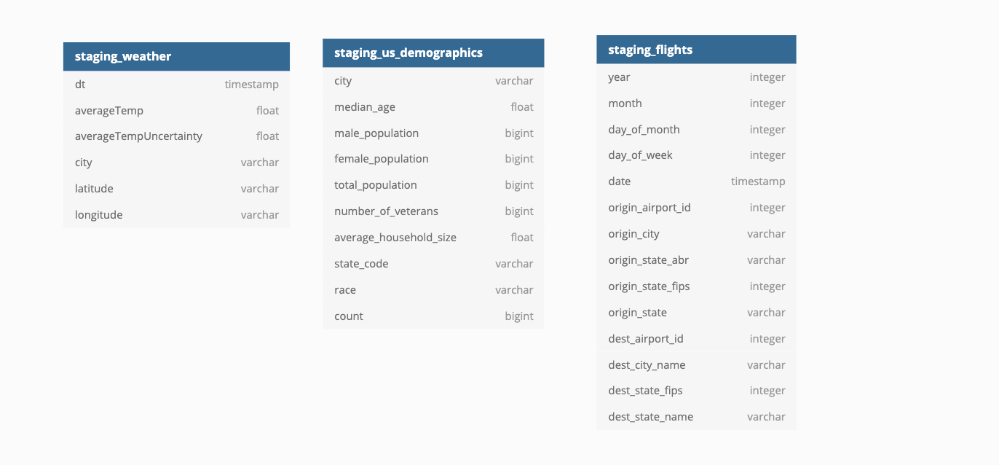

# DEND-Captsone
Capstone project for the data engineering nanodegree 

## SCOPE

This project was intended to demonstrate what I learned throughout the Udacity Data Engineering Nanodegree, specifically, creating ETL workflows using Apache Airflow, S3 and Redshift. We were allowed to choose our own data or use one of the data sets provided by Udacity. Udacity provided me with the weather and demographics data and I downloaded flight data from the Bureau of Transportation Statistics (BTS). The tables produced could be used to run various analyses related to travel and accessed by many people depending on business needs. 

This ETL could be run as flight and/or weather data is collected. The BTS releases data on flights monthly so I would recommend configuring this pipeline to run once a month which is what it is currently configured to do. 

## Requirements 
* Python 3.6 
* Apache Airflow - Allows for easy execution of ETL
* Amazon Redshift cluster - Data storage

## Files and Directories 
* dend_capstone/create_tables_task.py - Airflow DAG to create tables in Redshift
* dend_capstone/etl_task.py - Airflow DAG to execute ETL task 
* dend_captsone/helpers - Contains Airflow operators and SQL statements 

## Instructions
Start by launching a Redshift cluster. Now open the Airflow UI and add a connection to your cluster under 'redshift' and add your AWS credentials under connection 'aws_credentials'. Next, trigger dag named "create_table_task" which will create the tables in Redshift. Lastly, trigger the dag named "ETLDag" which will copy the data from S3 into Redshift and fill the fact and dimension tables. 

Tables are now ready for analysis.
## DATA  

* [Global Weather Data](https://www.kaggle.com/berkeleyearth/climate-change-earth-surface-temperature-data) - Weather data from around the world 
* [US Flight Data](https://www.transtats.bts.gov/DL_SelectFields.asp?Table_ID=236) - Flight data for US flights from 2009 - 2019
* [US Demographics Data](https://www.kaggle.com/berkeleyearth/climate-change-earth-surface-temperature-data) - Demographics for US cities 
## DATABASE SCHEMA
I chose this schema because it allowed for the data to be easily understood and easy to query. The flight and weather data each reference the cities and time table so it felt correct to design my schema around these two tables. Demographics table also references the cities table which allows for a relationship to be made between flights, weather and demographics. 

### Staging Tables 
* staging_weather
* staging_flights
* staging_demographics 

### Fact Tables 
* flights
* weather 
* demographics 
### Dimension Tables
* cities 
* time 

### Staging Tables Image

### Schema Image 

## Workflow

I used Apache Airflow to load the data from S3 to staging tables in Redshift. I then filled the fact and dimension tables by pulling data from the staging tables. I chose to use Airflow because it works extremly well for automating pipelines/workflows like this. The only "heavylifting" of this project was building the operators and writing SQL queries. I chose to use redshift because it is easy to integrate into a DAG and Redshifts copy command works well when reading data from S3. 

## Theoretical Scenarios 

Udacity's rubric for this project requires us to address the following three hypothetical scenarios and how I would adjust for them. 
#### Scenarios 
1. The data was increased by 100x.
2. The pipelines would be run on a daily basis by 7 am every day.
3. The database needed to be accessed by 100+ people.

#### Adjustments 
1. If the data increased by 100x in size I would continue using Redshift and Airflow but I would increase the number of nodes on my Redshift cluster. However, if my model had more writing involved I would use Apache Spark for distributed computing. 

2. If the pipelines needed to be run on a daily basis I would not have the tables be cleared when reloading the data in order to make it go faster. 

3. I dont see any issue with 100+ people using the Redshift endpoint so this system could handle that. 

## Conclusion 

In conclusion, this project allowed me to demonstrate my knowledge of data engineering technologies and practices. 
